# 🚀 AI Mock Interview Platform

## 🌟 Project Overview

A cutting-edge AI-powered mock interview platform designed to revolutionize interview preparation through advanced technology and intelligent feedback mechanisms.

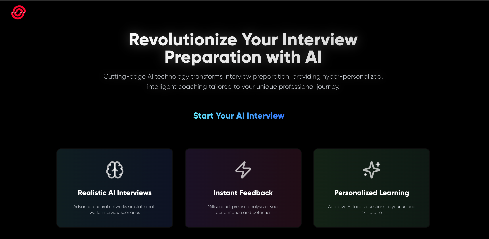

## 🔥 Key Features

### 🤖 AI-Powered Interview Generation
- Dynamically generates interview questions based on job roles
- Utilizes advanced AI to create context-specific questions
- Supports multiple tech stacks and experience levels

### 🎙️ Advanced Speech Recognition
- Real-time speech-to-text conversion
- Supports multiple languages
- Precise transcription with high accuracy

### 💡 Intelligent Feedback Mechanism
- AI-driven performance analysis
- Instant rating and detailed feedback
- Personalized improvement suggestions

### ❌ Delete Feature (New!)
- Users can delete past interview sessions
- Ensures privacy and control over data
- One-click deletion for convenience

### 🔒 Secure Authentication
- Seamless Clerk authentication
- User profile management
- Secure data handling

## 🛠 Tech Stack

### Frontend
- Next.js 15.3.9
- React 19.0.0
- Tailwind CSS 3.4.1
- Shadcn UI
- Framer Motion 12.5.0
- Lucide React Icons

### Backend
- Drizzle ORM 0.40.0
- Neon serverless database via `@neondatabase/serverless`
- Gemini AI via `@google/generative-ai`
- Speech Recognition API

### Authentication
- Clerk Authentication 6.12.2

### Deployment
- Vercel

## 🌈 UI/UX Highlights

- Futuristic, modern design
- Dark mode support
- Responsive across all devices
- Smooth, interactive animations
- Accessibility-focused components

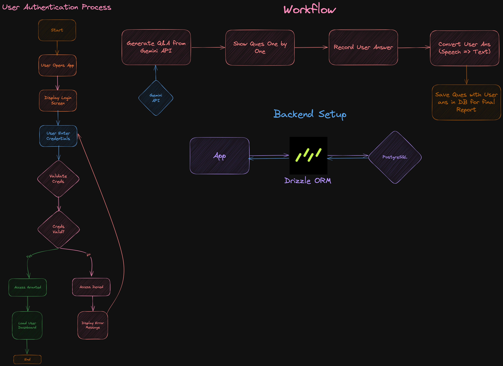

## 🚀 Getting Started

### Prerequisites
- Node.js v18 or newer
- npm
- Gemini AI API Key
- Clerk project credentials
- Neon / Drizzle database URL

### Installation

1. Clone the repository
```bash
git clone https://github.com/yuvrajtiwary-bitmesraece/AI-Mock-Interview.git
```

2. Install dependencies
```bash
cd AI-Mock-Interview
npm install
```

3. Create a `.env` file at the project root
```bash
copy conda NUL .env
```

4. Add the required environment variables
```bash
NEXT_PUBLIC_CLERK_PUBLISHABLE_KEY=
CLERK_SECRET_KEY=
NEXT_PUBLIC_GEMINI_API_KEY=
NEXT_PUBLIC_DRIZZLE_DB_URL=
```

5. Run the development server
```bash
npm run dev
```

6. Build for production
```bash
npm run build
```

### Optional database commands
```bash
npm run db:push
npm run db:studio
```

## 🔍 How It Works

1. User Authentication
   - Sign up/Login via Clerk
   - Create personalized profile

   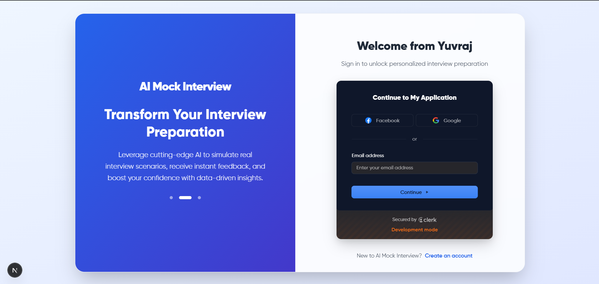

2. Interview Preparation
   - Select job role
   - Specify tech stack
   - Choose experience level

   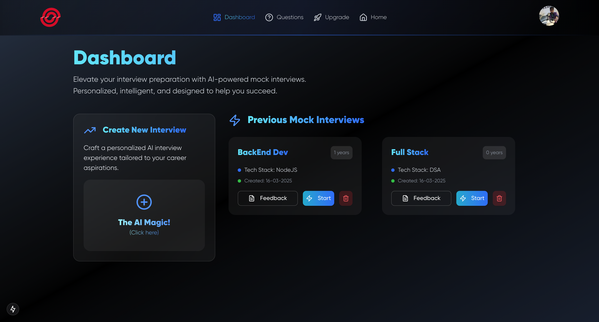
   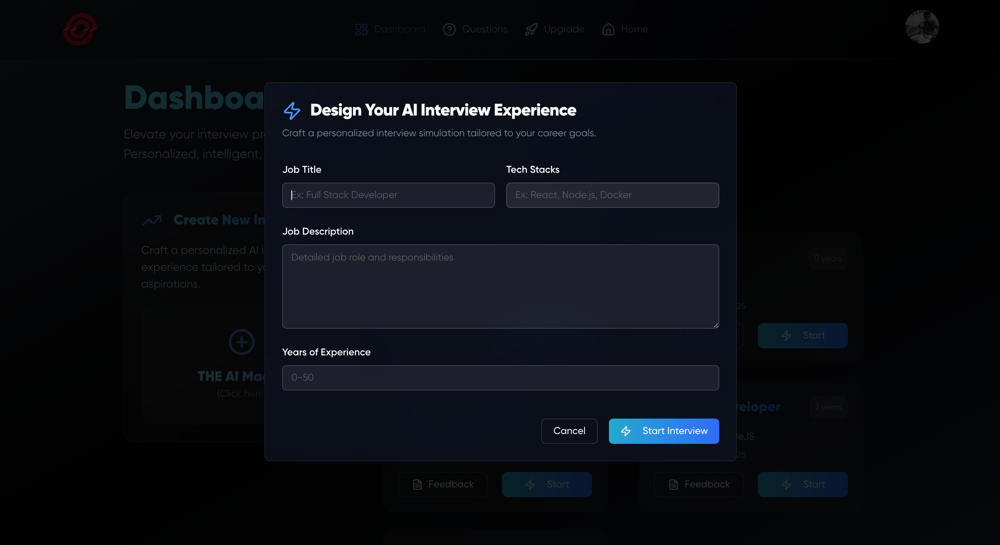
   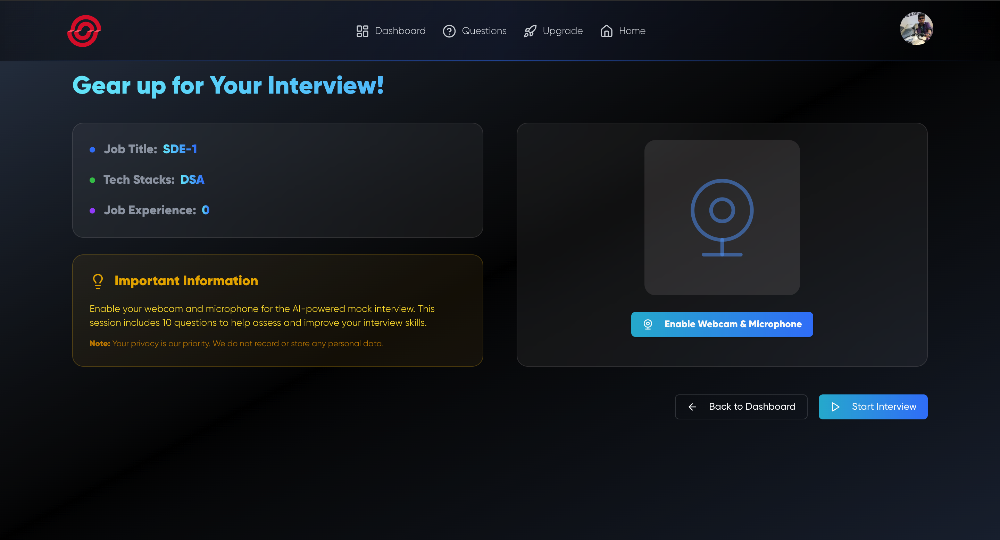

3. Mock Interview Process
   - AI generates contextual questions
   - Speech recognition captures answers
   - Real-time transcription
   
   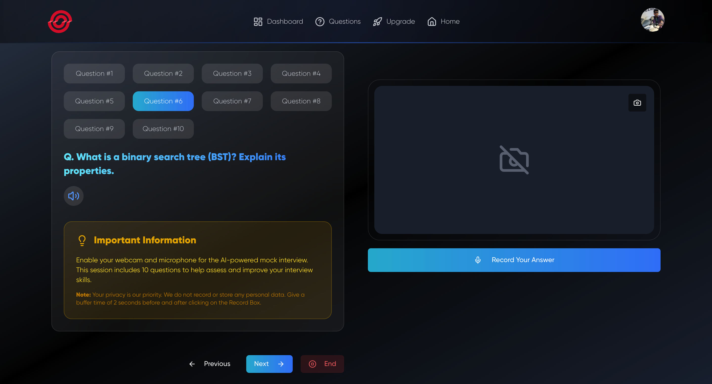
   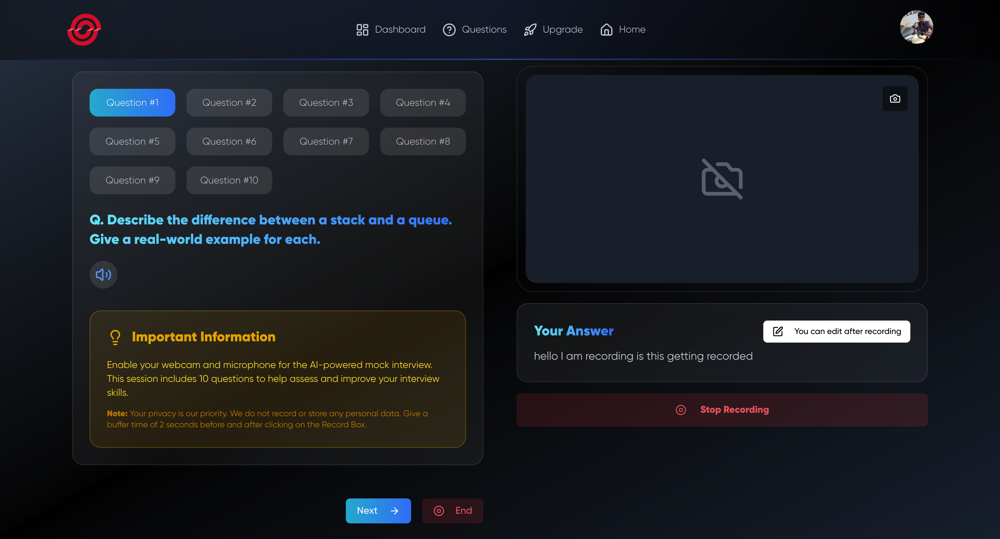
   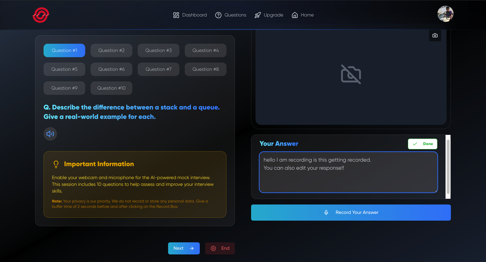

4. Delete Feature
   - Users can delete past interview sessions
   - Ensures privacy and control over data
   - One-click deletion for convenience
  
   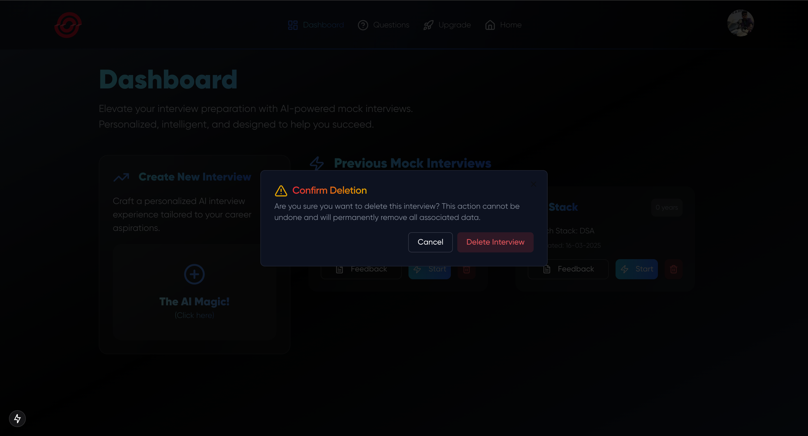
  
5. AI Generated Feedback
   - Instant AI feedback
   - Detailed analysis for each question
  
  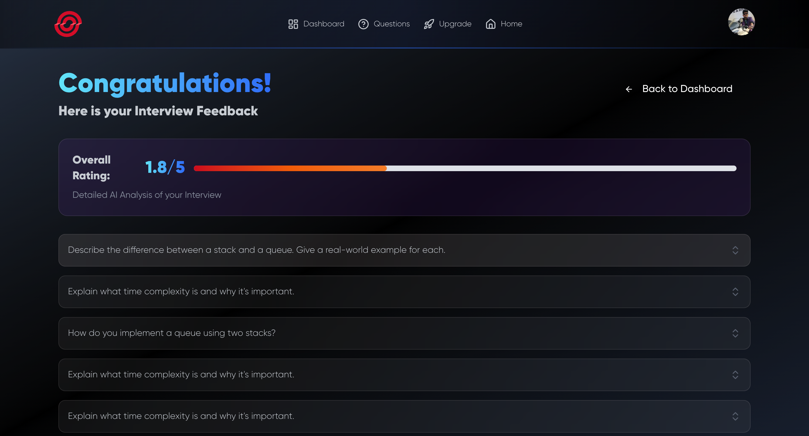
  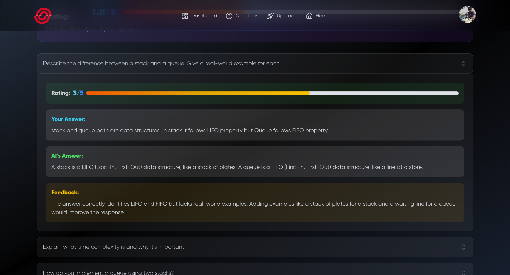
  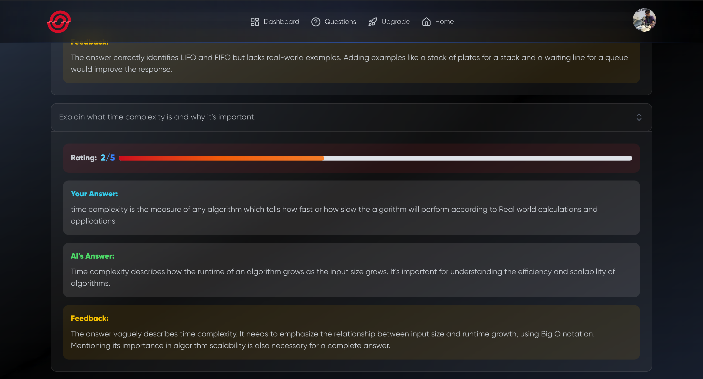

## 🎥 Demo

[Watch Project Demo Video](link_to_demo_video)

## 🌟 Key Differentiators

- 100% AI-powered question generation
- Adaptive learning mechanism
- Privacy-first approach
- No stored video/audio recordings
- Completely browser-based

## 🔮 Future Roadmap

- Multi-language support
- More interview domains
- Advanced analytics dashboard
- Machine learning-based personalization
- Integration with job platforms

## 📊 Performance Metrics

- Lighthouse Score: 90+
- Accessibility: WCAG 2.1 Compliant
- Responsive Design: 100%
- Browser Compatibility: Chrome, Firefox, Safari, Edge

## 🙌 Acknowledgements

- Gemini AI
- Clerk Authentication
- Next.js Community
- Tailwind CSS
- Open-source contributors

## 📞 Contact

Yuvraj Tiwary
- LinkedIn: [Profile Link](https://www.linkedin.com/in/yuvraj-tiwary-426279254/)
- Email: yuvrajtiwary699@gmail.com

## 📜 Copyright and Licensing

Copyright © 2026 Yuvraj Tiwary. All Rights Reserved.

This project's source code is provided for educational and demonstrational purposes only. You may view the code, but you are not permitted to modify, distribute, or use it in any of your own projects, whether personal or commercial, without the express written permission of the author.
---
